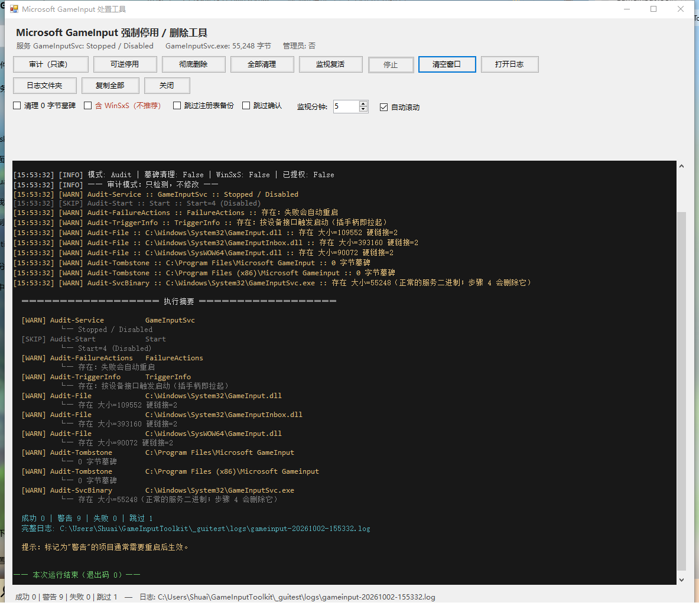

# Microsoft GameInput 强制停用 / 删除工具

针对 `GameInputSvc` 服务的提权处置工具。**双击 `GameInputTool.exe` 即可**，程序会自动弹出 UAC 请求管理员权限。

## 由AI Agent生成，不保证绝对的可用性

---

## 一、用法

### 图形化操作（推荐）

双击 **`GameInputTool.exe`** → UAC 弹窗点"是" → 打开**常驻日志窗口**。

窗口打开时会自动跑一次只读的 `Audit`，日志实时显示在窗口里，**不会一闪而过**。窗口顶部有模式按钮和选项，底部状态栏显示本次运行的成功/警告/失败计数与日志文件路径。

| 按钮 | 说明 |
|---|---|
| **审计（只读）** | 只检测不修改，随便点 |
| **可逆停用** | 摘触发器 + 停止 + `Disabled`，保留服务注册项 |
| **彻底删除** | 服务层 + 删除 SCM 注册项 + 删除 DLL |
| **全部清理** | 彻底删除 + 清理 0 字节墓碑 |
| **监视复活** | 监视 N 分钟（默认 5，可调 1–1440） |
| **停止** | 运行中可点，1 秒内响应；`Watch` 会报告真正监视了多久 |

其余按钮：`清空窗口`、`打开日志`（记事本打开本次日志）、`日志文件夹`、`复制全部`、`关闭`。
选项（勾选后对**新点开的**运行生效）：`清理 0 字节墓碑`、`含 WinSxS（不推荐）`、`跳过注册表备份`、`跳过确认`。

**安全性**：任何会修改系统的模式（`Soft` / `Full` / `Nuclear`）都会先弹出确认框，**必须手动输入大写的 `YES`** 才能点"继续"——避免误点。`Audit` 和 `Watch` 不修改系统，不会弹确认。



> 窗口模式固定走 `requireAdministrator`（双击即提权），因此不会在窗口里出现"权限不足"。如果在窗口里点 `Soft` 却看到 `[FAIL] 未以管理员身份运行`，说明用 `asInvoker` 清单重新编译过。
>
> 控制台窗口在 GUI 模式下会被自动隐藏（`ShowWindow(GetConsoleWindow(), SW_HIDE)`），只留日志窗口，不会出现两个窗口。

### 命令行


```
GameInputTool.exe [模式] [选项]
```

| 模式 | 作用 | 可逆性 |
|---|---|---|
| `Audit` | **只检测不修改**（默认） | — |
| `Soft` | 摘触发器 + 停止 + 设为 `Disabled`，**保留服务注册项** | ✅ 完全可逆 |
| `Full` | `Soft` + 删除 SCM 服务注册项 + 删除 DLL | ⚠️ 需备份 |
| `Nuclear` | `Full` + 清理 0 字节墓碑 | ⚠️ 需备份 |
| `Watch` | 监视 N 分钟，验证服务是否真的不复活了 | — |

| 选项 | 说明 |
|---|---|
| `-IncludeTombstones` | 清理 0 字节墓碑残留 |
| `-IncludeWinSxS` | ⚠️ **不推荐**，见下方说明 |
| `-NoBackup` | 跳过注册表导出备份 |
| `-Force` | 跳过交互确认 |
| `-WatchMinutes N` | `Watch` 模式监视时长（分钟，默认 5） |

示例：

```powershell
.\GameInputTool.exe                          # 审计
.\GameInputTool.exe Soft                     # 可逆停用（先跑这个）
.\GameInputTool.exe Full -IncludeTombstones  # 彻底删除
.\GameInputTool.exe Watch -WatchMinutes 10   # 验证不再复活
```

---

## 三、典型流程

```powershell
# 1. 先看现状
.\GameInputTool.exe -Mode Audit

# 2. 可逆停用 —— 如果只是不想让它自动起来，到这一步就够了
.\GameInputTool.exe -Mode Soft

# 3. 关键一步：插拔手柄 / 启动游戏，验证它不会复活
.\GameInputTool.exe -Mode Watch -WatchMinutes 10

# 4. 确认没问题后，再彻底删除
.\GameInputTool.exe -Mode Full -IncludeTombstones
```

> **建议先跑 `Soft` + `Watch`。** 如果 `Watch` 显示服务不复活，说明处置已经生效，此时是否还要删 DLL 由你决定——删掉后手柄相关功能会走其他路径。

---

## 四、回滚

`Soft` 模式随时可以恢复：

```powershell
sc config GameInputSvc start= demand
sc start  GameInputSvc
```

`Full` / `Nuclear` 需从备份恢复（程序执行前会自动导出注册表到 `backup\`）：

```powershell
reg import .\backup\GameInputSvc-<时间戳>.reg
```

DLL 的回滚：因为默认保留了 `WinSxS` 副本，可执行 `sfc /scannow` 让系统从组件存储重建链接；或先建系统还原点回滚。

---

## 五、文件清单

| 文件 | 说明 |
|---|---|
| **`GameInputTool.exe`** | **主程序**（C#，44 KB，已内嵌 `requireAdministrator` 清单，双击自动提权并打开日志窗口） |
| `GameInputTool.cs` | 源代码（主逻辑、命令行、输出路由） |
| `GuiForm.cs` | 常驻日志窗口的实现（WinForms） |
| `app.manifest` | UAC 清单（`requireAdministrator`） |
| `Remove-GameInput.ps1` | PowerShell 版本（功能等价，供审阅/二次开发） |
| `Run-Elevated.cmd` | PowerShell 版的双击启动器 |
| `Invoke-Elevated.ps1` | UAC 提权辅助脚本 |
| `Repair-GameInputComponents.ps1` | 组件存储投影诊断/修复（见第八节） |
| `Repair-GameInput.cmd` | 上者的双击启动器 |
| `window-preview.png` | 窗口外观截图 |
| `logs\` | 每次运行的时间戳日志 |
| `backup\` | 注册表导出备份 |

### 六、编译

无需 Visual Studio。窗口用了 WinForms，所以要**同时编译两个 `.cs`** 并额外引用两个程序集：

```powershell
C:\Windows\Microsoft.NET\Framework64\v4.0.30319\csc.exe `
  /nologo /target:exe /platform:anycpu /optimize+ /out:GameInputTool.exe `
  /win32manifest:app.manifest `
  /reference:System.dll /reference:System.Windows.Forms.dll /reference:System.Drawing.dll `
  GameInputTool.cs GuiForm.cs
```

> 只编译 `GameInputTool.cs` 会报 `CS0103: 不存在名称"Application"`。

**想调试又不想每次都弹 UAC**：把 `app.manifest` 里改成 `level="asInvoker"`，另存一份清单编译成测试副本即可（窗口、日志、只读的 `Audit` / `Watch` 都能正常用；`Soft` / `Full` / `Nuclear` 会被预检挡下并提示需要管理员）。

---

## 五、注意事项

- **程序的"强制关闭"** = 先 `ControlService(STOP)` 温和停止并等待 15 秒；超时则通过 `SERVICE_STATUS_PROCESS.dwProcessId` 拿到宿主进程 PID 并 `Process.Kill()` 强杀。
- 如果删除失败，**先临时关闭火绒的"文件实时监控"和"自我保护"**，再重试。
- 程序**不会**动 `GamingServices` / `GamingServicesNet` 服务（那是 Xbox/Gaming Services，与 GameInput 无关）——已确认它们仍在运行且未被修改。
- 做 `Full` / `Nuclear` 前建议**先创建系统还原点**。

---

## 六、组件存储修复（可选，已完成）

`Repair-GameInputComponents.ps1` 用于处理 `System32` 投影与 `WinSxS` 组件存储之间的不一致（投影被替换成 0 字节墓碑时）。**当前机器已修复完毕**，日常无需再跑。

| 模式 | 作用 |
|---|---|
| `Diagnose` | **只诊断**（默认，不需要管理员） |
| `Repair` | 重建硬链接投影并对齐属主 / ACL |
| `Deep` | 额外跑 `dism /Cleanup-Image /RestoreHealth` |

```powershell
# 只诊断
.\Repair-GameInput.cmd

# 修复（会弹 UAC）
.\Repair-GameInput.cmd Repair
```

修复后的正确形态（已核验）：

| 项目 | 期望值 |
|---|---|
| 大小 | `55248` 字节 |
| FileId | 与 `WinSxS\...gameinputinbox_7725...\GameInputSvc.exe` **一致** |
| 硬链接数 | `3` |
| 属主 | `NT SERVICE\TrustedInstaller` |
| SDDL | 与同组件参照文件 `GameInputInbox.dll` **完全一致** |
| 属性 | `0x20`（不再是墓碑的 `0x80020`） |

##许可证

[MIT](https://mit-license.org/)


## 特别鸣谢
[Deepseek](https://deepseek.com)
